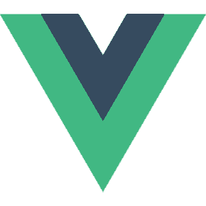

# Hello there 

### I'm Ioan, I create anything from nothing 🔥

## My Focus

### I strive for making enjoyable user experience, intuitive design & fast performance in any application.

##	Favourite Stack

	
	
	
	
	
	
	
	
	
	
	
	

### Also have great experience with

	
	
	
	
	
	
	
	
	
	
	
	
	
	
	
	
	<!--  -->

<!-- 
- 🔭 I’m currently working on ...
- 🌱 I’m currently learning ...
- 👯 I’m looking to collaborate on ...
- 🤔 I’m looking for help with ...
- 💬 Ask me about ...
- 📫 How to reach me: ...
- 😄 Pronouns: ...
- ⚡ Fun fact: ... -->

